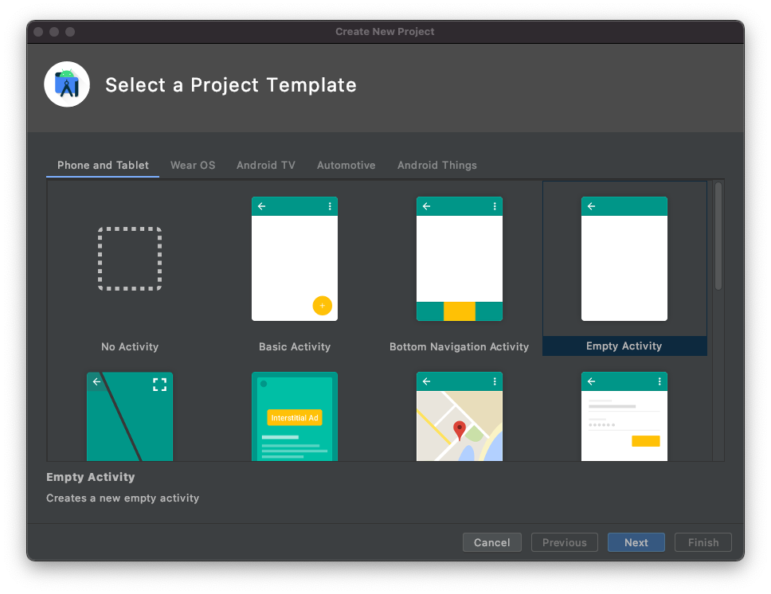

<!-- markdownlint-disable MD002 MD041 -->

Commencez par créer un nouveau projet Android Studio.

1. Ouvrez Android Studio, puis sélectionnez **Démarrer un nouveau projet Android Studio** dans l’écran d’accueil.

1. Dans la boîte de dialogue **créer un nouveau projet** , sélectionnez **activité vide**, puis **suivant**.

    

1. Dans la boîte de dialogue **configurer votre projet** , **** définissez le `Graph Tutorial`nom sur, vérifiez que le champ **langue** `Java`est défini sur et assurez-vous que le `API 27: Android 8.1 (Oreo)`niveau d' **API minimal** est défini sur. Modifiez le **nom du package** et **Enregistrez** -le si nécessaire. Sélectionnez **Terminer**.

    

> [!IMPORTANT]
> Assurez-vous d’entrer exactement le même nom pour le projet spécifié dans les instructions de l’atelier. Le nom du projet devient partie intégrante de l’espace de noms dans le code. Le code à l’intérieur de ces instructions dépend de l’espace de noms correspondant au nom de projet spécifié dans ces instructions. Si vous utilisez un nom de projet différent, le code n’est pas compilé, sauf si vous ajustez tous les espaces de noms pour qu’ils correspondent au nom de projet que vous entrez lors de la création du projet.

## <a name="install-dependencies"></a>Installer les dépendances

Avant de poursuivre, installez des dépendances supplémentaires que vous utiliserez plus tard.

- `com.android.support:design`pour que les dispositions de tiroir de navigation soient disponibles pour l’application.
- [Bibliothèque d’authentification Microsoft (MSAL) pour Android](https://github.com/AzureAD/microsoft-authentication-library-for-android) afin de gérer l’authentification Azure ad et la gestion des jetons.
- [Kit de développement logiciel (SDK) Microsoft Graph pour Java](https://github.com/microsoftgraph/msgraph-sdk-java) pour effectuer des appels à Microsoft Graph.

1. Développez **scripts Gradle**, puis ouvrez le fichier **Build. Gradle (module: App)** .

1. Ajoutez les lignes suivantes à l' `dependencies` intérieur de la valeur.

    ```Gradle
    implementation 'com.android.support:design:28.0.0'
    implementation 'com.microsoft.graph:microsoft-graph:1.4.0'
    implementation 'com.microsoft.identity.client:msal:0.2.2'
    ```

    > [!NOTE]
    > Si vous utilisez une version de kit de développement logiciel (SDK) différente `28.0.0` , veillez à modifier la `com.android.support:appcompat-v7` pour qu’elle corresponde à la version de la dépendance déjà présente dans **Build. gradle**.

1. Ajoutez un `packagingOptions` à l' `android` intérieur de la valeur dans le fichier **Build. gradle (module: App)** .

    ```Gradle
    packagingOptions {
        pickFirst 'META-INF/jersey-module-version'
    }
    ```

1. Enregistrez vos modifications. Dans le menu **fichier** , sélectionnez **synchroniser le projet avec les fichiers Gradle**.

## <a name="design-the-app"></a>Concevoir l’application

L’application utilise un [tiroir de navigation](https://developer.android.com/training/implementing-navigation/nav-drawer) pour naviguer entre les différentes vues. Dans cette étape, vous allez mettre à jour l’activité pour utiliser une disposition de tiroir de navigation et ajouter des fragments pour les vues.

### <a name="create-a-navigation-drawer"></a>Créer un tiroir de navigation

Dans cette section, vous allez créer des icônes pour le menu de navigation de l’application, créer un menu pour l’application et mettre à jour le thème et la disposition de l’application pour qu’elle soit compatible avec un tiroir de navigation.

#### <a name="create-icons"></a>Créer des icônes

1. Cliquez avec le bouton droit sur le dossier **app/res/Drawable** et sélectionnez **nouveau**, puis **élément vectoriel**.

1. Cliquez sur le bouton de l’icône en regard de image **clipart**.

1. Dans la **fenêtre Sélectionner une icône** , `home` saisissez dans la barre de recherche, puis sélectionnez l’icône **Accueil** et cliquez sur **OK**.

1. Remplacez le **nom** par `ic_menu_home`.

    

1. Sélectionnez **suivant**, puis **Terminer**.

1. Répétez l’étape précédente pour créer trois icônes supplémentaires.

    - Nom: `ic_menu_calendar`, icône:`event`
    - Nom: `ic_menu_signout`, icône:`exit to app`
    - Nom: `ic_menu_signin`, icône:`person add`

#### <a name="create-the-menu"></a>Créer le menu

1. Cliquez avec le bouton droit sur le dossier **res** , sélectionnez **nouveau**, puis **Répertoire de ressources Android**.

1. Modifiez le **type** de `menu` ressource et sélectionnez **OK**.

1. Cliquez avec le bouton droit sur le nouveau dossier de **menu** , sélectionnez **nouveau**, puis **fichier de ressources de menu**.

1. Nommez le `drawer_menu` fichier, puis sélectionnez **OK**.

1. Lorsque le fichier s’ouvre, sélectionnez l’onglet **texte** pour afficher le code XML, puis remplacez l’intégralité du contenu par ce qui suit.

    ```xml
    <?xml version="1.0" encoding="utf-8"?>
    <menu xmlns:android="http://schemas.android.com/apk/res/android"
        xmlns:tools="http://schemas.android.com/tools"
        tools:showIn="navigation_view">

        <group android:checkableBehavior="single">
            <item
                android:id="@+id/nav_home"
                android:icon="@drawable/ic_menu_home"
                android:title="Home" />

            <item
                android:id="@+id/nav_calendar"
                android:icon="@drawable/ic_menu_calendar"
                android:title="Calendar" />
        </group>

        <item android:title="Account">
            <menu>
                <item
                    android:id="@+id/nav_signin"
                    android:icon="@drawable/ic_menu_signin"
                    android:title="Sign In" />

                <item
                    android:id="@+id/nav_signout"
                    android:icon="@drawable/ic_menu_signout"
                    android:title="Sign Out" />
            </menu>
        </item>

    </menu>
    ```

#### <a name="update-application-theme-and-layout"></a>Mettre à jour le thème et la disposition de l’application

1. Ouvrez le fichier **app/res/values/styles. xml** et `Theme.AppCompat.Light.DarkActionBar` remplacez `Theme.AppCompat.Light.NoActionBar`par.

1. Ajoutez les lignes suivantes à l' `style` intérieur de l’élément.

    ```xml
    <item name="windowActionBar">false</item>
    <item name="windowNoTitle">true</item>
    <item name="android:statusBarColor">@android:color/transparent</item>
    ```

1. Cliquez avec le bouton droit sur le dossier **app/res/layout** .

1. Sélectionnez **nouveau**, puis **fichier de ressources de mise en page**.

1. Nommez le `nav_header` fichier et remplacez l' **élément racine** par `LinearLayout`, puis sélectionnez **OK**.

1. Ouvrez le fichier **nav_header. xml** et sélectionnez l’onglet **texte** . Remplacez tout le contenu par ce qui suit.

    ```xml
    <?xml version="1.0" encoding="utf-8"?>
    <LinearLayout xmlns:android="http://schemas.android.com/apk/res/android"
        android:layout_width="match_parent"
        android:layout_height="176dp"
        android:background="@color/colorPrimary"
        android:gravity="bottom"
        android:orientation="vertical"
        android:padding="16dp"
        android:theme="@style/ThemeOverlay.AppCompat.Dark">

        <ImageView
            android:id="@+id/user_profile_pic"
            android:layout_width="wrap_content"
            android:layout_height="wrap_content"
            android:src="@mipmap/ic_launcher" />

        <TextView
            android:id="@+id/user_name"
            android:layout_width="wrap_content"
            android:layout_height="wrap_content"
            android:paddingTop="8dp"
            android:text="Test User"
            android:textAppearance="@style/TextAppearance.AppCompat.Body1" />

        <TextView
            android:id="@+id/user_email"
            android:layout_width="wrap_content"
            android:layout_height="wrap_content"
            android:text="test@contoso.com" />

    </LinearLayout>
    ```

1. Ouvrez le fichier **app/res/layout/activity_main. xml** et mettez à jour la mise `DrawerLayout` en page en remplaçant le code XML existant par ce qui suit.

    ```xml
    <?xml version="1.0" encoding="utf-8"?>
    <android.support.v4.widget.DrawerLayout xmlns:android="http://schemas.android.com/apk/res/android"
        xmlns:app="http://schemas.android.com/apk/res-auto"
        xmlns:tools="http://schemas.android.com/tools"
        android:id="@+id/drawer_layout"
        android:layout_width="match_parent"
        android:layout_height="match_parent"
        android:fitsSystemWindows="true"
        tools:context=".MainActivity"
        tools:openDrawer="start">

        <RelativeLayout
            android:layout_width="match_parent"
            android:layout_height="match_parent"
            android:orientation="vertical">

            <ProgressBar
                android:id="@+id/progressbar"
                android:layout_width="75dp"
                android:layout_height="75dp"
                android:layout_centerInParent="true"
                android:visibility="gone"/>

            <android.support.v7.widget.Toolbar
                android:id="@+id/toolbar"
                android:layout_width="match_parent"
                android:layout_height="?attr/actionBarSize"
                android:background="@color/colorPrimary"
                android:elevation="4dp"
                android:theme="@style/ThemeOverlay.AppCompat.Dark.ActionBar" />

            <FrameLayout
                android:id="@+id/fragment_container"
                android:layout_width="match_parent"
                android:layout_height="match_parent"
                android:layout_below="@+id/toolbar" />
        </RelativeLayout>

        <android.support.design.widget.NavigationView
            android:id="@+id/nav_view"
            android:layout_width="wrap_content"
            android:layout_height="match_parent"
            android:layout_gravity="start"
            app:headerLayout="@layout/nav_header"
            app:menu="@menu/drawer_menu" />

    </android.support.v4.widget.DrawerLayout>
    ```

1. Ouvrez **app/res/values/Strings. xml** et ajoutez les éléments suivants `resources` à l’intérieur de l’élément.

    ```xml
    <string name="navigation_drawer_open">Open navigation drawer</string>
    <string name="navigation_drawer_close">Close navigation drawer</string>
    ```

1. Ouvrez le fichier **app/Java/com. example/graphtutorial/MainActivity** et remplacez l’intégralité du contenu par ce qui suit.

    ```java
    package com.example.graphtutorial;

    import android.support.annotation.NonNull;
    import android.support.design.widget.NavigationView;
    import android.support.v4.view.GravityCompat;
    import android.support.v4.widget.DrawerLayout;
    import android.support.v7.app.ActionBarDrawerToggle;
    import android.support.v7.app.AppCompatActivity;
    import android.os.Bundle;
    import android.support.v7.widget.Toolbar;
    import android.view.Menu;
    import android.view.MenuItem;
    import android.view.View;
    import android.widget.FrameLayout;
    import android.widget.ProgressBar;
    import android.widget.TextView;

    public class MainActivity extends AppCompatActivity implements NavigationView.OnNavigationItemSelectedListener {
        private DrawerLayout mDrawer;
        private NavigationView mNavigationView;
        private View mHeaderView;
        private boolean mIsSignedIn = false;
        private String mUserName = null;
        private String mUserEmail = null;

        @Override
        protected void onCreate(Bundle savedInstanceState) {
            super.onCreate(savedInstanceState);
            setContentView(R.layout.activity_main);

            // Set the toolbar
            Toolbar toolbar = findViewById(R.id.toolbar);
            setSupportActionBar(toolbar);

            mDrawer = findViewById(R.id.drawer_layout);

            // Add the hamburger menu icon
            ActionBarDrawerToggle toggle = new ActionBarDrawerToggle(this, mDrawer, toolbar,
                    R.string.navigation_drawer_open, R.string.navigation_drawer_close);
            mDrawer.addDrawerListener(toggle);
            toggle.syncState();

            mNavigationView = findViewById(R.id.nav_view);

            // Set user name and email
            mHeaderView = mNavigationView.getHeaderView(0);
            setSignedInState(mIsSignedIn);

            // Listen for item select events on menu
            mNavigationView.setNavigationItemSelectedListener(this);
        }

        @Override
        public boolean onNavigationItemSelected(@NonNull MenuItem menuItem) {
            // TEMPORARY
            return false;
        }

        @Override
        public void onBackPressed() {
            if (mDrawer.isDrawerOpen(GravityCompat.START)) {
                mDrawer.closeDrawer(GravityCompat.START);
            } else {
                super.onBackPressed();
            }
        }

        public void showProgressBar()
        {
            FrameLayout container = findViewById(R.id.fragment_container);
            ProgressBar progressBar = findViewById(R.id.progressbar);
            container.setVisibility(View.GONE);
            progressBar.setVisibility(View.VISIBLE);
        }

        public void hideProgressBar()
        {
            FrameLayout container = findViewById(R.id.fragment_container);
            ProgressBar progressBar = findViewById(R.id.progressbar);
            progressBar.setVisibility(View.GONE);
            container.setVisibility(View.VISIBLE);
        }

        // Update the menu and get the user's name and email
        private void setSignedInState(boolean isSignedIn) {
            mIsSignedIn = isSignedIn;

            Menu menu = mNavigationView.getMenu();

            // Hide/show the Sign in, Calendar, and Sign Out buttons
            menu.findItem(R.id.nav_signin).setVisible(!isSignedIn);
            menu.findItem(R.id.nav_calendar).setVisible(isSignedIn);
            menu.findItem(R.id.nav_signout).setVisible(isSignedIn);

            // Set the user name and email in the nav drawer
            TextView userName = mHeaderView.findViewById(R.id.user_name);
            TextView userEmail = mHeaderView.findViewById(R.id.user_email);

            if (isSignedIn) {
                // For testing
                mUserName = "Megan Bowen";
                mUserEmail = "meganb@contoso.com";

                userName.setText(mUserName);
                userEmail.setText(mUserEmail);
            } else {
                mUserName = null;
                mUserEmail = null;

                userName.setText("Please sign in");
                userEmail.setText("");
            }
        }
    }
    ```

### <a name="add-fragments"></a>Ajouter des fragments

Dans cette section, vous allez créer des fragments pour les affichages Accueil et calendrier.

1. Cliquez avec le bouton droit sur le dossier **app/res/layout** , puis sélectionnez **nouveau**, puis **fichier de ressources de mise en page**.

1. Nommez le `fragment_home` fichier et remplacez l' **élément racine** par `RelativeLayout`, puis sélectionnez **OK**.

1. Ouvrez le fichier **fragment_home. xml** et remplacez son contenu par ce qui suit.

    ```xml
    <?xml version="1.0" encoding="utf-8"?>
    <RelativeLayout xmlns:android="http://schemas.android.com/apk/res/android"
        android:layout_width="match_parent"
        android:layout_height="match_parent">

        <LinearLayout
            android:layout_width="wrap_content"
            android:layout_height="wrap_content"
            android:layout_centerInParent="true"
            android:orientation="vertical">

            <TextView
                android:layout_width="wrap_content"
                android:layout_height="wrap_content"
                android:layout_gravity="center_horizontal"
                android:text="Welcome!"
                android:textSize="30sp" />

            <TextView
                android:id="@+id/home_page_username"
                android:layout_width="wrap_content"
                android:layout_height="wrap_content"
                android:layout_gravity="center_horizontal"
                android:paddingTop="8dp"
                android:text="Please sign in"
                android:textSize="20sp" />
        </LinearLayout>

    </RelativeLayout>
    ```

1. Cliquez avec le bouton droit sur le dossier **app/res/layout** , puis sélectionnez **nouveau**, puis **fichier de ressources de mise en page**.

1. Nommez le `fragment_calendar` fichier et remplacez l' **élément racine** par `RelativeLayout`, puis sélectionnez **OK**.

1. Ouvrez le fichier **fragment_calendar. xml** et remplacez son contenu par ce qui suit.

    ```xml
    <?xml version="1.0" encoding="utf-8"?>
    <RelativeLayout xmlns:android="http://schemas.android.com/apk/res/android"
        android:layout_width="match_parent"
        android:layout_height="match_parent">

        <TextView
            android:layout_width="wrap_content"
            android:layout_height="wrap_content"
            android:layout_centerInParent="true"
            android:text="Calendar"
            android:textSize="30sp" />

    </RelativeLayout>
    ```

1. Cliquez avec le bouton droit sur le dossier **app/Java/com. example. graphtutorial** et sélectionnez **nouveau**, puis **classe Java**.

1. Nommez la `HomeFragment` classe et définissez la superclasse `android.support.v4.app.Fragment`sur, puis sélectionnez **OK**. ****

1. Ouvrez le fichier **HomeFragment** et remplacez son contenu par ce qui suit.

    ```java
    package com.example.graphtutorial;

    import android.os.Bundle;
    import android.support.annotation.NonNull;
    import android.support.annotation.Nullable;
    import android.support.v4.app.Fragment;
    import android.view.LayoutInflater;
    import android.view.View;
    import android.view.ViewGroup;
    import android.widget.TextView;

    public class HomeFragment extends Fragment {
        private static final String USER_NAME = "userName";

        private String mUserName;

        public HomeFragment() {

        }

        public static HomeFragment createInstance(String userName) {
            HomeFragment fragment = new HomeFragment();

            // Add the provided username to the fragment's arguments
            Bundle args = new Bundle();
            args.putString(USER_NAME, userName);
            fragment.setArguments(args);
            return fragment;
        }

        @Override
        public void onCreate(@Nullable Bundle savedInstanceState) {
            super.onCreate(savedInstanceState);
            if (getArguments() != null) {
                mUserName = getArguments().getString(USER_NAME);
            }
        }

        @Nullable
        @Override
        public View onCreateView(@NonNull LayoutInflater inflater, @Nullable ViewGroup container, @Nullable Bundle savedInstanceState) {
            View homeView = inflater.inflate(R.layout.fragment_home, container, false);

            // If there is a username, replace the "Please sign in" with the username
            if (mUserName != null) {
                TextView userName = homeView.findViewById(R.id.home_page_username);
                userName.setText(mUserName);
            }

            return homeView;
        }
    }
    ```

1. Cliquez avec le bouton droit sur le dossier **app/Java/com. example. graphtutorial** et sélectionnez **nouveau**, puis **classe Java**.

1. Nommez la `CalendarFragment` classe et définissez la superclasse `android.support.v4.app.Fragment`sur, puis sélectionnez **OK**. ****

1. Ouvrez le fichier **CalendarFragment** et ajoutez la fonction suivante à la `CalendarFragment` classe.

    ```java
    @Nullable
    @Override
    public View onCreateView(@NonNull LayoutInflater inflater, @Nullable ViewGroup container, @Nullable Bundle savedInstanceState) {
        return inflater.inflate(R.layout.fragment_calendar, container, false);
    }
    ```

1. Ouvrez le fichier **MainActivity. Java** et ajoutez les fonctions suivantes à la classe.

    ```java
    // Load the "Home" fragment
    public void openHomeFragment(String userName) {
        HomeFragment fragment = HomeFragment.createInstance(userName);
        getSupportFragmentManager().beginTransaction()
                .replace(R.id.fragment_container, fragment)
                .commit();
        mNavigationView.setCheckedItem(R.id.nav_home);
    }

    // Load the "Calendar" fragment
    private void openCalendarFragment() {
        getSupportFragmentManager().beginTransaction()
                .replace(R.id.fragment_container, new CalendarFragment())
                .commit();
        mNavigationView.setCheckedItem(R.id.nav_calendar);
    }

    private void signIn() {
        setSignedInState(true);
        openHomeFragment(mUserName);
    }

    private void signOut() {
        setSignedInState(false);
        openHomeFragment(mUserName);
    }
    ```

1. Remplacez la fonction `onNavigationItemSelected` existante par ce qui suit.

    ```java
    @Override
    public boolean onNavigationItemSelected(@NonNull MenuItem menuItem) {
        // Load the fragment that corresponds to the selected item
        switch (menuItem.getItemId()) {
            case R.id.nav_home:
                openHomeFragment(mUserName);
                break;
            case R.id.nav_calendar:
                openCalendarFragment();
                break;
            case R.id.nav_signin:
                signIn();
                break;
            case R.id.nav_signout:
                signOut();
                break;
        }

        mDrawer.closeDrawer(GravityCompat.START);

        return true;
    }
    ```

1. Ajoutez le code suivant à la fin de `onCreate` la fonction pour charger le fragment de domicile au démarrage de l’application.

    ```java
    // Load the home fragment by default on startup
    if (savedInstanceState == null) {
        openHomeFragment(mUserName);
    }
    ```

1. Enregistrez toutes vos modifications.

1. Dans le menu **exécuter** , sélectionnez **exécuter «application»**.

Le menu de l’application doit fonctionner pour naviguer entre les deux fragments et changer lorsque vous appuyez sur les boutons **se connecter** ou **se déconnecter** .


