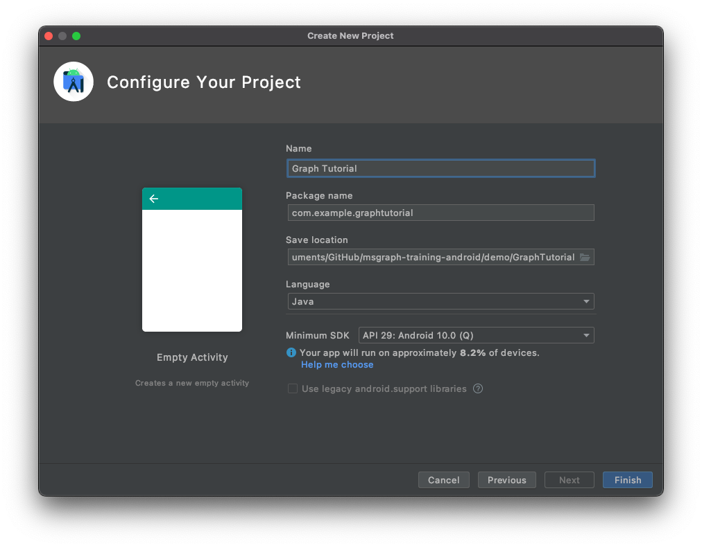

<!-- markdownlint-disable MD002 MD041 -->

<span data-ttu-id="f5cee-101">Commencez par créer un projet Android Studio.</span><span class="sxs-lookup"><span data-stu-id="f5cee-101">Begin by creating a new Android Studio project.</span></span>

1. <span data-ttu-id="f5cee-102">Ouvrez Android Studio, puis **sélectionnez Démarrer un nouveau** projet Android Studio sur l’écran d’accueil.</span><span class="sxs-lookup"><span data-stu-id="f5cee-102">Open Android Studio, and select **Start a new Android Studio project** on the welcome screen.</span></span>

1. <span data-ttu-id="f5cee-103">Dans la **boîte de dialogue Créer un** projet, sélectionnez Activité **vide,** puis **sélectionnez Suivant**.</span><span class="sxs-lookup"><span data-stu-id="f5cee-103">In the **Create New Project** dialog, select **Empty Activity**, then select **Next**.</span></span>

    

1. <span data-ttu-id="f5cee-105">Dans la **boîte de** dialogue  Configurer votre projet, définissez le nom sur , assurez-vous que le champ Langue est configuré sur , et assurez-vous que le niveau `Graph Tutorial`  `Java` **d’API** minimum est configuré sur `API 29: Android 10.0 (Q)` .</span><span class="sxs-lookup"><span data-stu-id="f5cee-105">In the **Configure your project** dialog, set the **Name** to `Graph Tutorial`, ensure the **Language** field is set to `Java`, and ensure the **Minimum API level** is set to `API 29: Android 10.0 (Q)`.</span></span> <span data-ttu-id="f5cee-106">Modifiez le **nom du package et** **l’emplacement d’enregistrer** selon vos besoins.</span><span class="sxs-lookup"><span data-stu-id="f5cee-106">Modify the **Package name** and **Save location** as needed.</span></span> <span data-ttu-id="f5cee-107">Sélectionnez **Terminer**.</span><span class="sxs-lookup"><span data-stu-id="f5cee-107">Select **Finish**.</span></span>

    

> [!IMPORTANT]
> <span data-ttu-id="f5cee-109">Le code et les instructions de ce didacticiel utilisent le nom du package **com.example.graphtutorial**.</span><span class="sxs-lookup"><span data-stu-id="f5cee-109">The code and instructions in this tutorial use the package name **com.example.graphtutorial**.</span></span> <span data-ttu-id="f5cee-110">Si vous utilisez un autre nom de package lors de la création du projet, n’oubliez pas d’utiliser votre nom de package partout où vous voyez cette valeur.</span><span class="sxs-lookup"><span data-stu-id="f5cee-110">If you use a different package name when creating the project, be sure to use your package name wherever you see this value.</span></span>

## <a name="install-dependencies"></a><span data-ttu-id="f5cee-111">Installer les dépendances</span><span class="sxs-lookup"><span data-stu-id="f5cee-111">Install dependencies</span></span>

<span data-ttu-id="f5cee-112">Avant de passer à autre chose, installez des dépendances supplémentaires que vous utiliserez ultérieurement.</span><span class="sxs-lookup"><span data-stu-id="f5cee-112">Before moving on, install some additional dependencies that you will use later.</span></span>

- <span data-ttu-id="f5cee-113">`com.google.android.material:material` pour rendre [l’affichage de navigation](https://material.io/develop/android/components/navigation-view/) disponible pour l’application.</span><span class="sxs-lookup"><span data-stu-id="f5cee-113">`com.google.android.material:material` to make the [navigation view](https://material.io/develop/android/components/navigation-view/) available to the app.</span></span>
- <span data-ttu-id="f5cee-114">[Bibliothèque d’authentification Microsoft (MSAL) pour Android pour gérer](https://github.com/AzureAD/microsoft-authentication-library-for-android) l’authentification Azure AD et la gestion des jetons.</span><span class="sxs-lookup"><span data-stu-id="f5cee-114">[Microsoft Authentication Library (MSAL) for Android](https://github.com/AzureAD/microsoft-authentication-library-for-android) to handle Azure AD authentication and token management.</span></span>
- <span data-ttu-id="f5cee-115">[SDK Microsoft Graph pour Java](https://github.com/microsoftgraph/msgraph-sdk-java) pour effectuer des appels à Microsoft Graph.</span><span class="sxs-lookup"><span data-stu-id="f5cee-115">[Microsoft Graph SDK for Java](https://github.com/microsoftgraph/msgraph-sdk-java) for making calls to the Microsoft Graph.</span></span>

1. <span data-ttu-id="f5cee-116">Développez **Les scripts Gradle,** puis **ouvrez build.gradle (Module : Graph_Tutorial.app).**</span><span class="sxs-lookup"><span data-stu-id="f5cee-116">Expand **Gradle Scripts**, then open **build.gradle (Module: Graph_Tutorial.app)**.</span></span>

1. <span data-ttu-id="f5cee-117">Ajoutez les lignes suivantes à l’intérieur de `dependencies` la valeur.</span><span class="sxs-lookup"><span data-stu-id="f5cee-117">Add the following lines inside the `dependencies` value.</span></span>

    :::code language="gradle" source="../demo/GraphTutorial/app/build.gradle" id="DependenciesSnippet":::

1. <span data-ttu-id="f5cee-118">Ajoutez `packagingOptions` une valeur à l’intérieur de la valeur dans `android` **build.gradle (Module : Graph_Tutorial.app).**</span><span class="sxs-lookup"><span data-stu-id="f5cee-118">Add a `packagingOptions` value inside the `android` value in **build.gradle (Module: Graph_Tutorial.app)**.</span></span>

    ```Gradle
    packagingOptions {
        pickFirst 'META-INF/jersey-module-version'
    }
    ```

1. <span data-ttu-id="f5cee-119">Ajoutez le référentiel Azure Maven pour la bibliothèque MicrosoftDeviceSDK, une dépendance de MSAL.</span><span class="sxs-lookup"><span data-stu-id="f5cee-119">Add the Azure Maven repository for the MicrosoftDeviceSDK library, a dependency of MSAL.</span></span> <span data-ttu-id="f5cee-120">Ouvrez **build.gradle (Project: Graph_Tutorial)**.</span><span class="sxs-lookup"><span data-stu-id="f5cee-120">Open **build.gradle (Project: Graph_Tutorial)**.</span></span> <span data-ttu-id="f5cee-121">Ajoutez ce qui suit à `repositories` la valeur à l’intérieur de la `allprojects` valeur.</span><span class="sxs-lookup"><span data-stu-id="f5cee-121">Add the following to the `repositories` value inside the `allprojects` value.</span></span>

    ```Gradle
    maven {
        url 'https://pkgs.dev.azure.com/MicrosoftDeviceSDK/DuoSDK-Public/_packaging/Duo-SDK-Feed/maven/v1'
    }
    ```

1. <span data-ttu-id="f5cee-122">Enregistrez vos modifications.</span><span class="sxs-lookup"><span data-stu-id="f5cee-122">Save your changes.</span></span> <span data-ttu-id="f5cee-123">Dans le menu **Fichier,** **sélectionnez Synchroniser le projet avec des fichiers Gradle.**</span><span class="sxs-lookup"><span data-stu-id="f5cee-123">On the **File** menu, select **Sync Project with Gradle Files**.</span></span>

## <a name="design-the-app"></a><span data-ttu-id="f5cee-124">Concevoir l’application</span><span class="sxs-lookup"><span data-stu-id="f5cee-124">Design the app</span></span>

<span data-ttu-id="f5cee-125">L’application utilise un bac de navigation pour naviguer entre les différents affichages.</span><span class="sxs-lookup"><span data-stu-id="f5cee-125">The application will use a navigation drawer to navigate between different views.</span></span> <span data-ttu-id="f5cee-126">Dans cette étape, vous allez mettre à jour l’activité pour utiliser une disposition de caisse de navigation et ajouter des fragments pour les vues.</span><span class="sxs-lookup"><span data-stu-id="f5cee-126">In this step you will update the activity to use a navigation drawer layout, and add fragments for the views.</span></span>

### <a name="create-a-navigation-drawer"></a><span data-ttu-id="f5cee-127">Créer un caisse de navigation</span><span class="sxs-lookup"><span data-stu-id="f5cee-127">Create a navigation drawer</span></span>

<span data-ttu-id="f5cee-128">Dans cette section, vous allez créer des icônes pour le menu de navigation de l’application, créer un menu pour l’application et mettre à jour le thème et la disposition de l’application pour qu’ils soient compatibles avec un bac de navigation.</span><span class="sxs-lookup"><span data-stu-id="f5cee-128">In this section you will create icons for the app's navigation menu, create a menu for the application, and update the application's theme and layout to be compatible with a navigation drawer.</span></span>

#### <a name="create-icons"></a><span data-ttu-id="f5cee-129">Créer des icônes</span><span class="sxs-lookup"><span data-stu-id="f5cee-129">Create icons</span></span>

1. <span data-ttu-id="f5cee-130">Cliquez avec le bouton droit **sur le dossier app/res/drawable** et sélectionnez **Nouveau,** puis **Vector Asset**.</span><span class="sxs-lookup"><span data-stu-id="f5cee-130">Right-click the **app/res/drawable** folder and select **New**, then **Vector Asset**.</span></span>

1. <span data-ttu-id="f5cee-131">Cliquez sur le bouton d’icône en haut du **ClipArt.**</span><span class="sxs-lookup"><span data-stu-id="f5cee-131">Click the icon button next to **Clip Art**.</span></span>

1. <span data-ttu-id="f5cee-132">Dans la **fenêtre Sélectionner une** icône, tapez dans la barre de recherche, puis sélectionnez l’icône Accueil et `home` **sélectionnez OK.** </span><span class="sxs-lookup"><span data-stu-id="f5cee-132">In the **Select Icon** window, type `home` in the search bar, then select the **Home** icon and select **OK**.</span></span>

1. <span data-ttu-id="f5cee-133">Changez **le nom** en `ic_menu_home` .</span><span class="sxs-lookup"><span data-stu-id="f5cee-133">Change the **Name** to `ic_menu_home`.</span></span>

    

1. <span data-ttu-id="f5cee-135">Sélectionnez **Suivant,** puis **Terminer.**</span><span class="sxs-lookup"><span data-stu-id="f5cee-135">Select **Next**, then **Finish**.</span></span>

1. <span data-ttu-id="f5cee-136">Répétez l’étape précédente pour créer quatre autres icônes.</span><span class="sxs-lookup"><span data-stu-id="f5cee-136">Repeat the previous step to create four more icons.</span></span>

    - <span data-ttu-id="f5cee-137">Name: `ic_menu_calendar` , Icon: `event`</span><span class="sxs-lookup"><span data-stu-id="f5cee-137">Name: `ic_menu_calendar`, Icon: `event`</span></span>
    - <span data-ttu-id="f5cee-138">Name: `ic_menu_add_event` , Icon: `add box`</span><span class="sxs-lookup"><span data-stu-id="f5cee-138">Name: `ic_menu_add_event`, Icon: `add box`</span></span>
    - <span data-ttu-id="f5cee-139">Name: `ic_menu_signout` , Icon: `exit to app`</span><span class="sxs-lookup"><span data-stu-id="f5cee-139">Name: `ic_menu_signout`, Icon: `exit to app`</span></span>
    - <span data-ttu-id="f5cee-140">Name: `ic_menu_signin` , Icon: `person add`</span><span class="sxs-lookup"><span data-stu-id="f5cee-140">Name: `ic_menu_signin`, Icon: `person add`</span></span>

#### <a name="create-the-menu"></a><span data-ttu-id="f5cee-141">Créer le menu</span><span class="sxs-lookup"><span data-stu-id="f5cee-141">Create the menu</span></span>

1. <span data-ttu-id="f5cee-142">Cliquez avec le bouton droit **sur le dossier res** et **sélectionnez Nouveau,** puis **Répertoire de ressources Android.**</span><span class="sxs-lookup"><span data-stu-id="f5cee-142">Right-click the **res** folder and select **New**, then **Android Resource Directory**.</span></span>

1. <span data-ttu-id="f5cee-143">Modifiez **le type de ressource** et `menu` sélectionnez **OK.**</span><span class="sxs-lookup"><span data-stu-id="f5cee-143">Change the **Resource type** to `menu` and select **OK**.</span></span>

1. <span data-ttu-id="f5cee-144">Cliquez avec le bouton droit sur le nouveau **dossier de menu** et **sélectionnez Nouveau,** puis **fichier de ressources menu.**</span><span class="sxs-lookup"><span data-stu-id="f5cee-144">Right-click the new **menu** folder and select **New**, then **Menu resource file**.</span></span>

1. <span data-ttu-id="f5cee-145">Nommez le fichier `drawer_menu` et sélectionnez **OK.**</span><span class="sxs-lookup"><span data-stu-id="f5cee-145">Name the file `drawer_menu` and select **OK**.</span></span>

1. <span data-ttu-id="f5cee-146">Lorsque le fichier s’ouvre, sélectionnez l’onglet **Code** pour afficher le code XML, puis remplacez tout le contenu par ce qui suit.</span><span class="sxs-lookup"><span data-stu-id="f5cee-146">When the file opens, select the **Code** tab to view the XML, then replace the entire contents with the following.</span></span>

    :::code language="xml" source="../demo/GraphTutorial/app/src/main/res/menu/drawer_menu.xml":::

#### <a name="update-application-theme-and-layout"></a><span data-ttu-id="f5cee-147">Mettre à jour le thème et la disposition de l’application</span><span class="sxs-lookup"><span data-stu-id="f5cee-147">Update application theme and layout</span></span>

1. <span data-ttu-id="f5cee-148">Ouvrez **le fichier app/res/values/styles.xml** et remplacez-le `Theme.AppCompat.Light.DarkActionBar` par `Theme.AppCompat.Light.NoActionBar` .</span><span class="sxs-lookup"><span data-stu-id="f5cee-148">Open the **app/res/values/styles.xml** file and replace `Theme.AppCompat.Light.DarkActionBar` with `Theme.AppCompat.Light.NoActionBar`.</span></span>

1. <span data-ttu-id="f5cee-149">Ajoutez les lignes suivantes à l’intérieur de `style` l’élément.</span><span class="sxs-lookup"><span data-stu-id="f5cee-149">Add the following lines inside the `style` element.</span></span>

    ```xml
    <item name="windowActionBar">false</item>
    <item name="windowNoTitle">true</item>
    <item name="android:statusBarColor">@android:color/transparent</item>
    ```

1. <span data-ttu-id="f5cee-150">Cliquez avec le bouton droit **sur le dossier application/res/layout.**</span><span class="sxs-lookup"><span data-stu-id="f5cee-150">Right-click the **app/res/layout** folder.</span></span>

1. <span data-ttu-id="f5cee-151">Sélectionnez **Nouveau,** puis **Fichier de ressources de disposition.**</span><span class="sxs-lookup"><span data-stu-id="f5cee-151">Select **New**, then **Layout resource file**.</span></span>

1. <span data-ttu-id="f5cee-152">Nommez le fichier `nav_header` et modifiez **l’élément racine** `LinearLayout` par , puis sélectionnez **OK**.</span><span class="sxs-lookup"><span data-stu-id="f5cee-152">Name the file `nav_header` and change the **Root element** to `LinearLayout`, then select **OK**.</span></span>

1. <span data-ttu-id="f5cee-153">Ouvrez **lenav_header.xml** et sélectionnez **l’onglet** Texte. Remplacez tout le contenu par ce qui suit.</span><span class="sxs-lookup"><span data-stu-id="f5cee-153">Open the **nav_header.xml** file and select the **Text** tab. Replace the entire contents with the following.</span></span>

    :::code language="xml" source="../demo/GraphTutorial/app/src/main/res/layout/nav_header.xml":::

1. <span data-ttu-id="f5cee-154">Ouvrez **le fichier app/res/layout/activity_main.xml** et mettez à jour la disposition en A en remplaçant le XML existant `DrawerLayout` par ce qui suit.</span><span class="sxs-lookup"><span data-stu-id="f5cee-154">Open the **app/res/layout/activity_main.xml** file and update the layout to a `DrawerLayout` by replacing the existing XML with the following.</span></span>

    :::code language="xml" source="../demo/GraphTutorial/app/src/main/res/layout/activity_main.xml":::

1. <span data-ttu-id="f5cee-155">Ouvrez **app/res/values/strings.xml** et ajoutez les éléments suivants à l’intérieur de l’élément. `resources`</span><span class="sxs-lookup"><span data-stu-id="f5cee-155">Open **app/res/values/strings.xml** and add the following elements inside the `resources` element.</span></span>

    ```xml
    <string name="navigation_drawer_open">Open navigation drawer</string>
    <string name="navigation_drawer_close">Close navigation drawer</string>
    ```

1. <span data-ttu-id="f5cee-156">Ouvrez **le fichier app/java/com.example/graphtutorial/MainActivity** et remplacez tout le contenu par ce qui suit.</span><span class="sxs-lookup"><span data-stu-id="f5cee-156">Open the **app/java/com.example/graphtutorial/MainActivity** file and replace the entire contents with the following.</span></span>

    ```java
    package com.example.graphtutorial;

    import android.os.Bundle;
    import android.view.Menu;
    import android.view.MenuItem;
    import android.view.View;
    import android.widget.FrameLayout;
    import android.widget.ProgressBar;
    import android.widget.TextView;
    import androidx.annotation.NonNull;
    import androidx.appcompat.app.ActionBarDrawerToggle;
    import androidx.appcompat.app.AppCompatActivity;
    import androidx.appcompat.widget.Toolbar;
    import androidx.core.view.GravityCompat;
    import androidx.drawerlayout.widget.DrawerLayout;
    import com.google.android.material.navigation.NavigationView;

    public class MainActivity extends AppCompatActivity implements NavigationView.OnNavigationItemSelectedListener {
        private static final String SAVED_IS_SIGNED_IN = "isSignedIn";
        private static final String SAVED_USER_NAME = "userName";
        private static final String SAVED_USER_EMAIL = "userEmail";
        private static final String SAVED_USER_TIMEZONE = "userTimeZone";

        private DrawerLayout mDrawer;
        private NavigationView mNavigationView;
        private View mHeaderView;
        private boolean mIsSignedIn = false;
        private String mUserName = null;
        private String mUserEmail = null;
        private String mUserTimeZone = null;

        @Override
        protected void onCreate(Bundle savedInstanceState) {
            super.onCreate(savedInstanceState);
            setContentView(R.layout.activity_main);

            // Set the toolbar
            Toolbar toolbar = findViewById(R.id.toolbar);
            setSupportActionBar(toolbar);

            mDrawer = findViewById(R.id.drawer_layout);

            // Add the hamburger menu icon
            ActionBarDrawerToggle toggle = new ActionBarDrawerToggle(this, mDrawer, toolbar,
                    R.string.navigation_drawer_open, R.string.navigation_drawer_close);
            mDrawer.addDrawerListener(toggle);
            toggle.syncState();

            mNavigationView = findViewById(R.id.nav_view);

            // Set user name and email
            mHeaderView = mNavigationView.getHeaderView(0);
            setSignedInState(mIsSignedIn);

            // Listen for item select events on menu
            mNavigationView.setNavigationItemSelectedListener(this);

            if (savedInstanceState == null) {
                // Load the home fragment by default on startup
                openHomeFragment(mUserName);
            } else {
                // Restore state
                mIsSignedIn = savedInstanceState.getBoolean(SAVED_IS_SIGNED_IN);
                mUserName = savedInstanceState.getString(SAVED_USER_NAME);
                mUserEmail = savedInstanceState.getString(SAVED_USER_EMAIL);
                mUserTimeZone = savedInstanceState.getString(SAVED_USER_TIMEZONE);
                setSignedInState(mIsSignedIn);
            }
        }

        @Override
        protected void onSaveInstanceState(@NonNull Bundle outState) {
            super.onSaveInstanceState(outState);
            outState.putBoolean(SAVED_IS_SIGNED_IN, mIsSignedIn);
            outState.putString(SAVED_USER_NAME, mUserName);
            outState.putString(SAVED_USER_EMAIL, mUserEmail);
            outState.putString(SAVED_USER_TIMEZONE, mUserTimeZone);
        }

        @Override
        public boolean onNavigationItemSelected(@NonNull MenuItem menuItem) {
            // TEMPORARY
            return false;
        }

        @Override
        public void onBackPressed() {
            if (mDrawer.isDrawerOpen(GravityCompat.START)) {
                mDrawer.closeDrawer(GravityCompat.START);
            } else {
                super.onBackPressed();
            }
        }

        public void showProgressBar()
        {
            FrameLayout container = findViewById(R.id.fragment_container);
            ProgressBar progressBar = findViewById(R.id.progressbar);
            container.setVisibility(View.GONE);
            progressBar.setVisibility(View.VISIBLE);
        }

        public void hideProgressBar()
        {
            FrameLayout container = findViewById(R.id.fragment_container);
            ProgressBar progressBar = findViewById(R.id.progressbar);
            progressBar.setVisibility(View.GONE);
            container.setVisibility(View.VISIBLE);
        }

        // Update the menu and get the user's name and email
        private void setSignedInState(boolean isSignedIn) {
            mIsSignedIn = isSignedIn;

            mNavigationView.getMenu().clear();
            mNavigationView.inflateMenu(R.menu.drawer_menu);

            Menu menu = mNavigationView.getMenu();

            // Hide/show the Sign in, Calendar, and Sign Out buttons
            if (isSignedIn) {
                menu.removeItem(R.id.nav_signin);
            } else {
                menu.removeItem(R.id.nav_home);
                menu.removeItem(R.id.nav_calendar);
                menu.removeItem(R.id.nav_create_event);
                menu.removeItem(R.id.nav_signout);
            }

            // Set the user name and email in the nav drawer
            TextView userName = mHeaderView.findViewById(R.id.user_name);
            TextView userEmail = mHeaderView.findViewById(R.id.user_email);

            if (isSignedIn) {
                // For testing
                mUserName = "Lynne Robbins";
                mUserEmail = "lynner@contoso.com";
                mUserTimeZone = "Pacific Standard Time";

                userName.setText(mUserName);
                userEmail.setText(mUserEmail);
            } else {
                mUserName = null;
                mUserEmail = null;
                mUserTimeZone = null;

                userName.setText("Please sign in");
                userEmail.setText("");
            }
        }
    }
    ```

### <a name="add-fragments"></a><span data-ttu-id="f5cee-157">Ajouter des fragments</span><span class="sxs-lookup"><span data-stu-id="f5cee-157">Add fragments</span></span>

<span data-ttu-id="f5cee-158">Dans cette section, vous allez créer des fragments pour les affichages d’accueil et de calendrier.</span><span class="sxs-lookup"><span data-stu-id="f5cee-158">In this section you will create fragments for the home and calendar views.</span></span>

1. <span data-ttu-id="f5cee-159">Cliquez avec le bouton droit sur le **dossier application/res/layout** et sélectionnez **Nouveau,** puis fichier **de ressources de disposition.**</span><span class="sxs-lookup"><span data-stu-id="f5cee-159">Right-click the **app/res/layout** folder and select **New**, then **Layout resource file**.</span></span>

1. <span data-ttu-id="f5cee-160">Nommez le fichier `fragment_home` et modifiez **l’élément racine** `RelativeLayout` par , puis sélectionnez **OK**.</span><span class="sxs-lookup"><span data-stu-id="f5cee-160">Name the file `fragment_home` and change the **Root element** to `RelativeLayout`, then select **OK**.</span></span>

1. <span data-ttu-id="f5cee-161">Ouvrez **fragment_home.xml** fichier et remplacez son contenu par ce qui suit.</span><span class="sxs-lookup"><span data-stu-id="f5cee-161">Open the **fragment_home.xml** file and replace its contents with the following.</span></span>

    :::code language="xml" source="../demo/GraphTutorial/app/src/main/res/layout/fragment_home.xml":::

1. <span data-ttu-id="f5cee-162">Cliquez avec le bouton droit sur le **dossier application/res/layout** et sélectionnez **Nouveau,** puis fichier **de ressources de disposition.**</span><span class="sxs-lookup"><span data-stu-id="f5cee-162">Right-click the **app/res/layout** folder and select **New**, then **Layout resource file**.</span></span>

1. <span data-ttu-id="f5cee-163">Nommez le fichier `fragment_calendar` et modifiez **l’élément racine** `RelativeLayout` par , puis sélectionnez **OK**.</span><span class="sxs-lookup"><span data-stu-id="f5cee-163">Name the file `fragment_calendar` and change the **Root element** to `RelativeLayout`, then select **OK**.</span></span>

1. <span data-ttu-id="f5cee-164">Ouvrez **fragment_calendar.xml** fichier et remplacez son contenu par ce qui suit.</span><span class="sxs-lookup"><span data-stu-id="f5cee-164">Open the **fragment_calendar.xml** file and replace its contents with the following.</span></span>

    ```xml
    <?xml version="1.0" encoding="utf-8"?>
    <RelativeLayout xmlns:android="http://schemas.android.com/apk/res/android"
        android:layout_width="match_parent"
        android:layout_height="match_parent">

        <TextView
            android:layout_width="wrap_content"
            android:layout_height="wrap_content"
            android:layout_centerInParent="true"
            android:text="Calendar"
            android:textSize="30sp" />

    </RelativeLayout>
    ```

1. <span data-ttu-id="f5cee-165">Cliquez avec le bouton droit sur le **dossier application/res/layout** et sélectionnez **Nouveau,** puis fichier **de ressources de disposition.**</span><span class="sxs-lookup"><span data-stu-id="f5cee-165">Right-click the **app/res/layout** folder and select **New**, then **Layout resource file**.</span></span>

1. <span data-ttu-id="f5cee-166">Nommez le fichier `fragment_new_event` et modifiez **l’élément racine** `RelativeLayout` par , puis sélectionnez **OK**.</span><span class="sxs-lookup"><span data-stu-id="f5cee-166">Name the file `fragment_new_event` and change the **Root element** to `RelativeLayout`, then select **OK**.</span></span>

1. <span data-ttu-id="f5cee-167">Ouvrez **fragment_new_event.xml** fichier et remplacez son contenu par ce qui suit.</span><span class="sxs-lookup"><span data-stu-id="f5cee-167">Open the **fragment_new_event.xml** file and replace its contents with the following.</span></span>

    ```xml
    <?xml version="1.0" encoding="utf-8"?>
    <RelativeLayout xmlns:android="http://schemas.android.com/apk/res/android"
        android:layout_width="match_parent"
        android:layout_height="match_parent">

        <TextView
            android:layout_width="wrap_content"
            android:layout_height="wrap_content"
            android:layout_centerInParent="true"
            android:text="New Event"
            android:textSize="30sp" />

    </RelativeLayout>
    ```

1. <span data-ttu-id="f5cee-168">Cliquez avec le bouton droit sur le dossier **app/java/com.example.graphtutorial** et sélectionnez **Nouveau,** **puis Java classe .**</span><span class="sxs-lookup"><span data-stu-id="f5cee-168">Right-click the **app/java/com.example.graphtutorial** folder and select **New**, then **Java Class**.</span></span>

1. <span data-ttu-id="f5cee-169">Nommez la `HomeFragment` classe, puis sélectionnez **OK.**</span><span class="sxs-lookup"><span data-stu-id="f5cee-169">Name the class `HomeFragment`, then select **OK**.</span></span>

1. <span data-ttu-id="f5cee-170">Ouvrez **le fichier HomeFragment** et remplacez son contenu par ce qui suit.</span><span class="sxs-lookup"><span data-stu-id="f5cee-170">Open the **HomeFragment** file and replace its contents with the following.</span></span>

    :::code language="java" source="../demo/GraphTutorial/app/src/main/java/com/example/graphtutorial/HomeFragment.java" id="HomeSnippet":::

1. <span data-ttu-id="f5cee-171">Cliquez avec le bouton droit sur le dossier **app/java/com.example.graphtutorial** et sélectionnez **Nouveau,** **puis Java classe .**</span><span class="sxs-lookup"><span data-stu-id="f5cee-171">Right-click the **app/java/com.example.graphtutorial** folder and select **New**, then **Java Class**.</span></span>

1. <span data-ttu-id="f5cee-172">Nommez la `CalendarFragment` classe, puis sélectionnez **OK.**</span><span class="sxs-lookup"><span data-stu-id="f5cee-172">Name the class `CalendarFragment`, then select **OK**.</span></span>

1. <span data-ttu-id="f5cee-173">Ouvrez **le fichier CalendarFragment** et remplacez son contenu par ce qui suit.</span><span class="sxs-lookup"><span data-stu-id="f5cee-173">Open the **CalendarFragment** file and replace its contents with the following.</span></span>

    ```java
    package com.example.graphtutorial;

    import android.os.Bundle;
    import android.view.LayoutInflater;
    import android.view.View;
    import android.view.ViewGroup;
    import androidx.annotation.NonNull;
    import androidx.annotation.Nullable;
    import androidx.fragment.app.Fragment;

    public class CalendarFragment extends Fragment {
        private static final String TIME_ZONE = "timeZone";

        private String mTimeZone;

        public CalendarFragment() {}

        public static CalendarFragment createInstance(String timeZone) {
            CalendarFragment fragment = new CalendarFragment();

            // Add the provided time zone to the fragment's arguments
            Bundle args = new Bundle();
            args.putString(TIME_ZONE, timeZone);
            fragment.setArguments(args);
            return fragment;
        }

        @Override
        public void onCreate(@Nullable Bundle savedInstanceState) {
            super.onCreate(savedInstanceState);
            if (getArguments() != null) {
                mTimeZone = getArguments().getString(TIME_ZONE);
            }
        }

        @Nullable
        @Override
        public View onCreateView(@NonNull LayoutInflater inflater, @Nullable ViewGroup container, @Nullable Bundle savedInstanceState) {
            return inflater.inflate(R.layout.fragment_calendar, container, false);
        }
    }
    ```

1. <span data-ttu-id="f5cee-174">Cliquez avec le bouton droit sur le dossier **app/java/com.example.graphtutorial** et sélectionnez **Nouveau,** **puis Java classe .**</span><span class="sxs-lookup"><span data-stu-id="f5cee-174">Right-click the **app/java/com.example.graphtutorial** folder and select **New**, then **Java Class**.</span></span>

1. <span data-ttu-id="f5cee-175">Nommez la `NewEventFragment` classe, puis sélectionnez **OK.**</span><span class="sxs-lookup"><span data-stu-id="f5cee-175">Name the class `NewEventFragment`, then select **OK**.</span></span>

1. <span data-ttu-id="f5cee-176">Ouvrez **le fichier NewEventFragment** et remplacez son contenu par ce qui suit.</span><span class="sxs-lookup"><span data-stu-id="f5cee-176">Open the **NewEventFragment** file and replace its contents with the following.</span></span>

    ```java
    package com.example.graphtutorial;

    import android.os.Bundle;
    import android.view.LayoutInflater;
    import android.view.View;
    import android.view.ViewGroup;
    import androidx.annotation.NonNull;
    import androidx.annotation.Nullable;
    import androidx.fragment.app.Fragment;

    public class NewEventFragment extends Fragment {
        private static final String TIME_ZONE = "timeZone";

        private String mTimeZone;

        public NewEventFragment() {}

        public static NewEventFragment createInstance(String timeZone) {
            NewEventFragment fragment = new NewEventFragment();

            // Add the provided time zone to the fragment's arguments
            Bundle args = new Bundle();
            args.putString(TIME_ZONE, timeZone);
            fragment.setArguments(args);
            return fragment;
        }

        @Override
        public void onCreate(@Nullable Bundle savedInstanceState) {
            super.onCreate(savedInstanceState);
            if (getArguments() != null) {
                mTimeZone = getArguments().getString(TIME_ZONE);
            }
        }

        @Nullable
        @Override
        public View onCreateView(@NonNull LayoutInflater inflater, @Nullable ViewGroup container, @Nullable Bundle savedInstanceState) {
            return inflater.inflate(R.layout.fragment_new_event, container, false);
        }
    }
    ```

1. <span data-ttu-id="f5cee-177">Ouvrez **le fichier MainActivity.java** et ajoutez les fonctions suivantes à la classe.</span><span class="sxs-lookup"><span data-stu-id="f5cee-177">Open the **MainActivity.java** file and add the the following functions to the class.</span></span>

    ```java
    // Load the "Home" fragment
    public void openHomeFragment(String userName) {
        HomeFragment fragment = HomeFragment.createInstance(userName);
        getSupportFragmentManager().beginTransaction()
                .replace(R.id.fragment_container, fragment)
                .commit();
        mNavigationView.setCheckedItem(R.id.nav_home);
    }

    // Load the "Calendar" fragment
    private void openCalendarFragment(String timeZone) {
        CalendarFragment fragment = CalendarFragment.createInstance(timeZone);
        getSupportFragmentManager().beginTransaction()
                .replace(R.id.fragment_container, fragment)
                .commit();
        mNavigationView.setCheckedItem(R.id.nav_calendar);
    }

    // Load the "New Event" fragment
    private void openNewEventFragment(String timeZone) {
        NewEventFragment fragment = NewEventFragment.createInstance(timeZone);
        getSupportFragmentManager().beginTransaction()
                .replace(R.id.fragment_container, fragment)
                .commit();
        mNavigationView.setCheckedItem(R.id.nav_create_event);
    }

    private void signIn() {
        setSignedInState(true);
        openHomeFragment(mUserName);
    }

    private void signOut() {
        setSignedInState(false);
        openHomeFragment(mUserName);
    }
    ```

1. <span data-ttu-id="f5cee-178">Remplacez la fonction `onNavigationItemSelected` existante par ce qui suit.</span><span class="sxs-lookup"><span data-stu-id="f5cee-178">Replace the existing `onNavigationItemSelected` function with the following.</span></span>

    :::code language="java" source="../demo/GraphTutorial/app/src/main/java/com/example/graphtutorial/MainActivity.java" id="OnNavItemSelectedSnippet":::

1. <span data-ttu-id="f5cee-179">Enregistrez toutes vos modifications.</span><span class="sxs-lookup"><span data-stu-id="f5cee-179">Save all of your changes.</span></span>

1. <span data-ttu-id="f5cee-180">Dans **le** menu Exécuter, **sélectionnez Exécuter « application**».</span><span class="sxs-lookup"><span data-stu-id="f5cee-180">On the **Run** menu, select **Run 'app'**.</span></span>

<span data-ttu-id="f5cee-181">Le menu de l’application doit fonctionner pour naviguer entre  les deux fragments et changer lorsque vous appuyez sur les boutons Se connectez ou **se connectez.**</span><span class="sxs-lookup"><span data-stu-id="f5cee-181">The app's menu should work to navigate between the two fragments and change when you tap the **Sign in** or **Sign out** buttons.</span></span>


