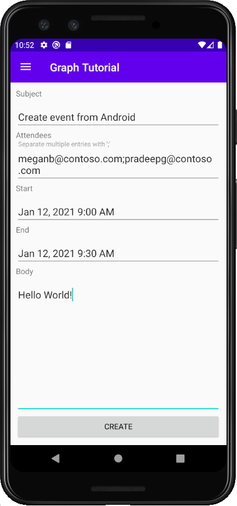

<!-- markdownlint-disable MD002 MD041 -->

Dans cette section, vous allez ajouter la possibilité de créer des événements sur le calendrier de l’utilisateur.

1. Ouvrez **GraphHelper** et ajoutez les `import` instructions suivantes en haut du fichier.

    ```java
    import com.microsoft.graph.models.extensions.Attendee;
    import com.microsoft.graph.models.extensions.DateTimeTimeZone;
    import com.microsoft.graph.models.extensions.EmailAddress;
    import com.microsoft.graph.models.extensions.ItemBody;
    import com.microsoft.graph.models.generated.AttendeeType;
    import com.microsoft.graph.models.generated.BodyType;
    ```

1. Ajoutez la fonction suivante à `GraphHelper` la classe pour créer un événement.

    :::code language="java" source="../demo/GraphTutorial/app/src/main/java/com/example/graphtutorial/GraphHelper.java" id="CreateEventSnippet":::

## <a name="update-new-event-fragment"></a>Mettre à jour un nouveau fragment d’événement

1. Cliquez avec le bouton droit sur le dossier **app/java/com.example.graphtutorial** et sélectionnez **Nouveau,** **puis Java classe .** Nommez la classe `EditTextDateTimePicker` et sélectionnez **OK.**

1. Ouvrez le nouveau fichier et remplacez son contenu par ce qui suit.

    :::code language="java" source="../demo/GraphTutorial/app/src/main/java/com/example/graphtutorial/EditTextDateTimePicker.java" id="DateTimePickerSnippet":::

    Cette classe encapsule un contrôle, affichant un s picker de date et d’heure lorsque l’utilisateur l’appuye, et mettant à jour la valeur avec la date et l’heure `EditText` de sélection.

1. Ouvrez **app/res/layout/fragment_new_event.xml** et remplacez son contenu par ce qui suit.

    :::code language="xml" source="../demo/GraphTutorial/app/src/main/res/layout/fragment_new_event.xml":::

1. Ouvrez **NewEventFragment** et ajoutez les `import` instructions suivantes en haut du fichier.

    ```java
    import android.util.Log;
    import android.widget.Button;
    import com.google.android.material.snackbar.BaseTransientBottomBar;
    import com.google.android.material.snackbar.Snackbar;
    import com.google.android.material.textfield.TextInputLayout;
    import com.microsoft.graph.concurrency.ICallback;
    import com.microsoft.graph.core.ClientException;
    import com.microsoft.graph.models.extensions.Event;
    import com.microsoft.identity.client.AuthenticationCallback;
    import com.microsoft.identity.client.IAuthenticationResult;
    import com.microsoft.identity.client.exception.MsalException;
    import java.time.ZoneId;
    import java.time.ZonedDateTime;
    ```

1. Ajoutez les membres suivants à la `NewEventFragment` classe.

    :::code language="java" source="../demo/GraphTutorial/app/src/main/java/com/example/graphtutorial/NewEventFragment.java" id="InputsSnippet":::

1. Ajoutez les fonctions suivantes pour afficher et masquer une barre de progression.

    :::code language="java" source="../demo/GraphTutorial/app/src/main/java/com/example/graphtutorial/NewEventFragment.java" id="ProgressBarSnippet":::

1. Ajoutez les fonctions suivantes pour obtenir les valeurs des contrôles d’entrée et appeler la `GraphHelper.createEvent` fonction.

    :::code language="java" source="../demo/GraphTutorial/app/src/main/java/com/example/graphtutorial/NewEventFragment.java" id="CreateEventSnippet":::

1. Remplacez `onCreateView` l’existant par ce qui suit.

    :::code language="java" source="../demo/GraphTutorial/app/src/main/java/com/example/graphtutorial/NewEventFragment.java" id="OnCreateViewSnippet":::

1. Enregistrez vos modifications, puis redémarrez l’application. Sélectionnez **l’élément de** menu Nouvel événement, remplissez le formulaire, puis sélectionnez **CRÉER.**

    
